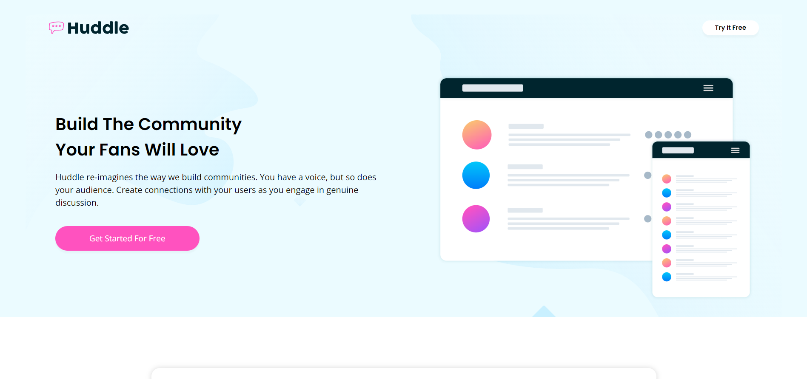

# Frontend Mentor - Huddle landing page with alternating feature blocks solution

This is a solution to the [Huddle landing page with alternating feature blocks challenge on Frontend Mentor](https://www.frontendmentor.io/challenges/huddle-landing-page-with-alternating-feature-blocks-5ca5f5981e82137ec91a5100). Frontend Mentor challenges help you improve your coding skills by building realistic projects. 

## Table of contents

- [Overview](#overview)
  - [The challenge](#the-challenge)
  - [Screenshot](#screenshot)
  - [Links](#links)
- [My process](#my-process)
  - [Built with](#built-with)
  - [What I learned](#what-i-learned)
  - [Useful resources](#useful-resources)
- [Author](#author)

## Overview

### The challenge

Users should be able to:

- View the optimal layout for the site depending on their device's screen size
- See hover states for all interactive elements on the page

### Screenshot

### Links

- Solution URL: [Add solution URL here](https://your-solution-url.com)
- Live Site URL: [Add live site URL here](https://your-live-site-url.com)

## My process

### Built with

- Semantic HTML5 markup
- CSS custom properties
- Flexbox
- CSS Grid

### What I learned

Learned how to change color in svg's and how difficult it can be to convert mobile design to desktop design without analyzing both design's.

### Useful resources

- [Stackoverflow](https://stackoverflow.com/questions/22252472/how-can-i-change-the-color-of-an-svg-element) - This helped me to understand how can we change color in svg's.
- [CSS Trick](https://css-tricks.com/change-color-of-svg-on-hover/) - I also this resource also for svg's.

## Author

- Frontend Mentor - [@udaymishra04](https://www.frontendmentor.io/profile/udaymishra04)
- Twitter - [@uudaymishraa](https://www.twitter.com/uudaymishraa)